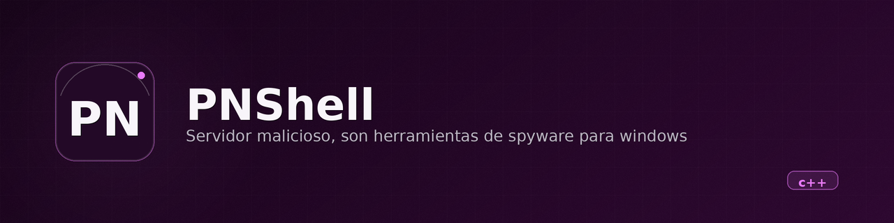

<p align="center">
  
</p>

<h1 align="center">PNShell</h1>

<p align="center">
  
</p>


<p align="center"><b>A Windows C++ agent toolkit (launcher, reverse shell, keylogger, screen capturer) — a malware development learning project, for lab environments only.</b></p>

<p align="center">
  
  
  
  
</p>

---

## ⚠️ What this is

PNShell is the **client/agent side of a remote-access tool (RAT-style)**. It is educational malware: code written to learn how Windows agent tooling works internally (process spawning, raw Winsock sockets, `GetAsyncKeyState`, GDI screen capture). It has **no legitimate day-to-day use**. Run it only on machines you own or in an isolated VM lab, and never against systems without explicit consent. Deploying it on third-party machines is illegal in most jurisdictions.

## What it is

Four small Win32 programs built from one CMake project. A hidden launcher starts three agents, and each agent connects back to a hardcoded TCP port on `127.0.0.1`:

| Binary | Source | What it does | Port |
|---|---|---|---|
| `PNShell.exe` | `src/main.cpp` | Hides its console, checks the other three binaries exist, spawns them with `CreateProcess` (`CREATE_NO_WINDOW`) | — |
| `libval.exe` | `src/reverse_shell.cpp` | Connects to a TCP socket and attaches `cmd.exe` to it via `STARTF_USESTDHANDLES`, giving the listener an interactive shell | 28129 |
| `libarbys.exe` | `src/key_logger.cpp` | Polls every virtual key with `GetAsyncKeyState` and sends key names (`{Enter}`, `{Shift}`, plain chars…) in a loop | 10266 |
| `libwv.exe` | `src/window_viewer.cpp` | Captures the full desktop with GDI (`BitBlt`), encodes JPEG in memory with stb_image_write, sends an 8-byte size header plus the image, forever | 23112 |

`src/connection.hpp` holds the shared `connect_server()` helper (raw `WSAConnect` to `inet_addr("127.0.0.1")`) and `src/errors.hpp` the exit-on-error helpers. `stb_image.h` / `stb_image_write.h` are the vendored stb single-header libraries, kept when OpenCV was dropped.

**In one sentence:** a Windows spyware toolkit that opens a remote cmd, logs keystrokes, and streams screenshots back to a listener on localhost — written as a learning exercise, unfinished.

## State

| | |
|---|---|
| **State** | Prototipo, inactive (last code commit 2024-08; the 2026-09 commit only adds generated docs) |
| **Last activity** | 2024-08 (`CHANGELOG: Se simplifico la conexion... removio OpenCV a favor de stb`) |
| **Usable today** | Partially, in a lab: build on Windows with MSVC, run listeners on ports 28129/10266/23112 of `127.0.0.1`, run `PNShell.exe`. There is no server implementation in this repo — you must bring your own `netcat`-style listeners |
| **What's missing** | See below |
| **Known risks / debt** | See below |

**What's missing** (checked against the source, not intentions):

- The **server/listener side** does not exist in the repo; the agents are useless without one.
- TODOs left in `src/reverse_shell.cpp:46-49`: file transfer, priority handling, encryption, keylogger integration — the reverse shell has no features beyond raw cmd I/O.
- **Hardcoded everything**: host is `inet_addr("127.0.0.1")` (`connection.hpp:21`), ports are `#define` literals. No config, no CLI arguments.
- No persistence, no service install, no obfuscation — it survives until reboot.

**Known issues / fragile points:**

- `libarbys` sends every key as a fixed `send(..., 14, ...)` (`key_logger.cpp:14-15`), so short messages ship uninitialized buffer bytes.
- `libwv` inserts its 8-byte size header at the start of a buffer that already begins with JPEG data (`window_viewer.cpp:88-91`), shifting/corrupting the stream, and reuses `bi.biHeight` after `GetDIBits` may have modified it (`window_viewer.cpp:56`).
- Error paths sometimes pass `SOCKET` handles into `error(const char*, int)` as the error code (`window_viewer.cpp:80`).
- `main.cpp` relies on `Windows.h` types without including it directly (it comes transitively from `errors.hpp`).
- `build/` (MSVC `.vcxproj`, CMake cache, `.obj`, `.exe` artifacts) is committed to git.

## Why it exists

Personal learning project (May–August 2024): understanding how reverse shells, keyloggers and screen-capture agents are implemented against the raw Win32/Winsock API, with no frameworks. OpenCV was used in the first screen-capture version and was deliberately replaced by the lighter `stb_image_write` JPEG encoder (commit 2024-08-06).

## Installation and usage

Requirements: **Windows** with MSVC (the committed `build/` was generated with CMake 3.29 + Visual Studio) and CMake ≥ 3.29. The commands below were **not executed during this documentation** (written from a Linux host; the project cannot compile there — the build fails at `#include <Windows.h>` in `src/errors.hpp:3`), so treat them as the standard path, not a verified one.

```powershell
cmake -B build -G "Visual Studio 17 2022"
cmake --build build --config Release
# binaries land in build/<config>/
```

```powershell
# Listener side (NOT part of this repo — bring your own netcat-style listeners)
nc -lvp 28129                 # reverse shell
nc -lvp 10266                 # keystrokes
nc -lvp 23112 > screen.jpg    # raw JPEG stream with an 8-byte size prefix

# Agent host (lab VM only):
PNShell.exe                   # hides itself and spawns libval.exe, libarbys.exe, libwv.exe
```

## Stack

- **Language / runtime:** C++ (Win32 API + Winsock 2), Windows only
- **Build system:** CMake ≥ 3.29, four `add_executable` targets, no C++ standard set (compiler default)
- **Dependencies:** none beyond the Win32/Winsock SDK; `stb_image.h` + `stb_image_write.h` vendored in `src/`
- **What it deliberately does NOT use:** no external libraries (OpenCV was removed in favor of stb), no persistence mechanisms, no encryption, no dynamic configuration

## Architecture

```
PNShell.exe (launcher, hidden console)
   ├─ spawns libval.exe    ── TCP 28129 ──►  listener: cmd.exe stdin/stdout/stderr
   ├─ spawns libarbys.exe  ── TCP 10266 ──►  listener: key names / characters
   └─ spawns libwv.exe     ── TCP 23112 ──►  listener: [8B size][JPEG] loop
                  all targets hardcoded to 127.0.0.1 (connection.hpp)
```

## Repository structure

```
src/main.cpp            # launcher: validates and spawns the three agents
src/reverse_shell.cpp   # libval: cmd.exe piped through a TCP socket
src/key_logger.cpp      # libarbys: GetAsyncKeyState polling loop
src/window_viewer.cpp   # libwv: GDI capture → JPEG → socket stream
src/connection.hpp      # shared connect_server() (host/port hardcoded)
src/errors.hpp          # error()/sys_error() helpers
src/stb_image*.h        # vendored stb single-header libs
CMakeLists.txt          # 4 executables, no library target
build/                  # committed MSVC build artifacts (should not be in git)
```

## Roadmap (if ever resumed)

- [x] Reverse shell with terminal attached to socket
- [x] Keylogger (virtual-key sweep + special-key names)
- [x] Screen capture streaming (GDI + stb JPEG, replaced OpenCV)
- [ ] Server/listener side (nowhere in the repo)
- [ ] Configurable host/ports (currently hardcoded to `127.0.0.1`)
- [ ] File transfer, encryption, task priority (TODOs in `reverse_shell.cpp`)
- [ ] Fix keylogger message framing and `window_viewer` size-header logic
- [ ] Remove `build/` from git, add a `LICENSE`

## Notes and decisions

- **No license file.** As-is, the code is "visible, not open source"; all rights stay with the author. A license (or archiving) is needed before it can be presented publicly.
- **stb over OpenCV** was a deliberate simplification (2024-08-06): encoding a GDI bitmap to JPEG needs ~40 lines, not a full CV dependency.
- **Everything points to `127.0.0.1`**, which makes the project safe to test solo: with no listener, the agents exit through `error()` immediately. It also means it was never designed to work over a network as committed.
- The agents fail hard: any socket/setup error prints and `exit(-1)`s; there is no retry or reconnect logic.
- The README previously in the repo was an auto-generated stub (from a 2026-09 documentation batch) with machine-local paths and generic commands; this document replaces it based on direct reading of the source.

## License

None. All rights reserved by the author (Gonanf). See the warning at the top before doing anything with this code.

---
